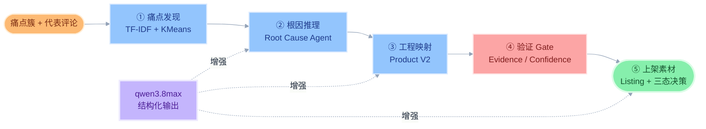
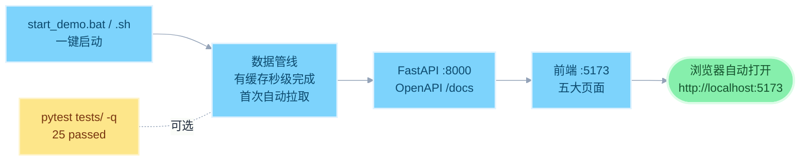

# Review2Product｜全球消费者评论驱动的产品进化智能体

<p align="center">
  <b>让全球消费者的每一条差评，都成为下一代产品的设计参数</b><br>
  基于 qwen3.8max 的 Agent 系统：数据爬取 → 数据蒸馏 → 构建模型 → 根因推理 → 参数级产品改进 → 上架素材。
</p>

<p align="center">
  
  
  
  
  
</p>

<p align="center">
  
  
  
  
  
</p>


---

## 项目一句话

**Review2Product** 是一个面向跨境电商卖家与品牌方的**产品进化智能体**：把海量真实消费者差评自动转化为**可回溯证据（Evidence）、痛点优先级（PainScore）、产品参数级改进（Product V2）与上架素材（Listing）**。

Agent 决策层由**阿里云百炼 qwen3.8max** 驱动，完整覆盖「数据爬取 → 数据蒸馏 → 构建模型 → Agent 推理」全流程：

> **消费者评论（18,167 条真实数据）→ 痛点聚类与可解释评分 → 证据回溯 → qwen3.8max 根因推理 → 产品参数改进 → Listing 上架文案**

与普通评论分析工具的区别：

| | 普通情感分析 | 通用 LLM 直接分析 | Review2Product |
|---|---|---|---|
| 回答的问题 | 用户满意吗？ | 总结一下评论？ | 用户**为什么**不满意？下一代商品**改什么**？ |
| 输入上限 | 全量 | 上下文塞不下 18k 评论 | **全量** |
| 输出 | 正/负面占比报表 | 一篇作文 | 痛点聚类 + 根因 + **参数级改进** + Listing |
| 可信度 | 黑盒打分 | 随机、不可复现 | 每个结论点击回溯 **12 条原始评论** |
| 断网可用 | 部分 | 否 | **是（四级数据降级 + 规则兜底）** |

---

## 1. 关键信息速查

| 项 | 值 |
| --- | --- |
| 项目定位 | 全球消费者评论 → 产品进化 Agent（AI 市场洞察 + AI 智能上新） |
| 大模型 | **阿里云百炼 qwen3.8max**（Root Cause / Product Engineer / Listing 三 Agent） |
| 数据源 | **Amazon Reviews 2023**（McAuley Lab 官方公开数据集，HF 镜像获取） |
| 数据规模 | 载入 19,210 行 → 蒸馏提纯 18,167 行 · 25 商品 · 4,696 条负面评论 |
| Demo 商品 | B07C533XCW · Segbeauty 喷雾瓶（1,420 评论 / 211 负面 / 4.44★，2018-07 → 2023-01） |
| 管线性能 | 全管线实测 **3.1 秒**（纯 CPU，无 GPU 要求） |
| 测试 | pytest **25 passed**（数据管线 / 评分公式 / 聚类标注 / 证据链 / V2 Schema 反虚构 / API） |
| 依赖成本 | **0 元**：无 SimilarWeb / Helium10 / JungleScout 等任何付费工具与 API |
| LLM 双模 | qwen3.8max 增强 ⇄ 规则引擎兜底（无 Key 完整可跑，Schema 不变） |

---

## 2. 总体架构：五层流水线

```mermaid
%%{init: {"theme": "base", "themeVariables": {"fontFamily": "Inter, Microsoft YaHei, sans-serif", "background": "#FFFFFF", "primaryColor": "#F8FAFC", "primaryTextColor": "#1E293B", "primaryBorderColor": "#CBD5E1", "lineColor": "#94A3B8"}}}%%
flowchart LR
    A(["评论数据源<br/>Amazon Reviews 2023"]):::input
    B["数据爬取与蒸馏<br/>清洗/去重/负面筛选<br/>19,210 → 18,167"]:::data
    C["构建模型<br/>TF-IDF+KMeans 聚类<br/>PainScore 可解释评分"]:::engine
    D["证据引擎<br/>每结论 12 条原始评论"]:::store
    E["qwen3.8max Agent<br/>根因 / 工程参数 / Listing"]:::agent
    F(["FastAPI + React<br/>五大页面交付"]):::output

    A --> B --> C --> D --> E --> F

    classDef input fill:#FDBA74,stroke:#FFEDD5,color:#7C2D12,stroke-width:2px;
    classDef data fill:#93C5FD,stroke:#DBEAFE,color:#1E3A8A,stroke-width:2px;
    classDef engine fill:#5EEAD4,stroke:#CCFBF1,color:#134E4A,stroke-width:2px;
    classDef store fill:#FDE68A,stroke:#FEF3C7,color:#78350F,stroke-width:2px;
    classDef agent fill:#C4B5FD,stroke:#EDE9FE,color:#4C1D95,stroke-width:2px;
    classDef output fill:#86EFAC,stroke:#DCFCE7,color:#14532D,stroke-width:2px;
```



**确定性优先的设计原则**：PainScore 由四因子公式确定性计算（LLM 无权干预，同数据同结果）；qwen3.8max 负责根因推理与文案生成的语义部分，所有输出经 Pydantic 结构化校验，并强制携带证据评论 ID。

---

## 3. Agent 工作流：推理链路 + 反幻觉验证



**三重反幻觉防线**：

1. **Evidence Gate**——证据不足的结论显式标记 `insufficient_evidence`，不上屏；
2. **反虚构校验**——工程数值不敢编：数值型建议强制标注 `engineering validation required`，并有专门测试 `test_no_fabricated_engineering_numbers` 防回归；
3. **诚实标注**——痛点词典覆盖不到的聚类诚实标记 `Other: <top keywords>` 并建议人工评审，绝不硬贴标签。

---

## 4. 核心结果：Demo 商品真实运行数据

Hero 商品 B07C533XCW（Segbeauty 喷雾瓶）从 211 条差评中挖出 5 个痛点（4 个词典命中 + 1 个诚实 Other）：

| 痛点 | PainScore | 评论数 | 平均分 | 占负面比 | 证据 |
| --- | ---: | ---: | ---: | ---: | --- |
| Functional Failure 功能失效 | **100.0** | 77 | 1.43★ | 36.5% | 12 条 ✅ |
| Cleaning Difficulty 难清洁 | 59.4 | 36 | 1.97★ | 17.1% | 12 条 ✅ |
| Drying & Clogging 堵塞干涸 | 46.6 | 48 | 1.98★ | 22.8% | 12 条 ✅ |
| Durability 耐用性 | ✔ 已评分 | 19 | 1.32★ | 9.0% | 12 条 ✅ |
| Other（诚实标注） | ✔ 已评分 | 31 | 1.97★ | 14.7% | 12 条 ✅ |

Agent 层产出：**10 项参数级改进**（如「机构寿命强化 + 出厂功能全检」，依据 77 条差评、置信度 92%）+ **5 条卖点 · 5 组 FAQ · 6 张主图策略**，每个 claim 锚定一个已解决痛点及其评论数。

**Before → After（人工/传统工具 → Review2Product）**：

| 维度 | Before | After |
| --- | --- | --- |
| 痛点发现 | 人工抽样阅读 3-5 天/SKU | 全量聚类 **3 秒** |
| 优先级 | 拍脑袋排期 | PainScore 四因子可解释排序 |
| 证据 | 无 / 截图散落 | 每结论点击回溯 12 条原始评论 |
| 行动 | 一份报表 | 10 项参数改进 + 完整 Listing |
| 可信度 | 「我觉得」 | 「依据 77 条真实差评，平均 1.43★」 |

---

## 5. 快速开始



```bash
cd review2product

# 方式一：一键启动（Windows）
start_demo.bat
# macOS / Linux
./start_demo.sh

# 方式二：手动分步
python -m venv .venv && .venv\Scripts\pip install -r requirements.txt   # macOS: .venv/bin/pip
python scripts/run_pipeline.py                                          # 数据爬取→蒸馏→建模→分析产物
.venv\Scripts\uvicorn backend.app.main:app --port 8000                  # 后端 API
cd frontend && npm install && npm run dev                               # 前端 http://localhost:5173

# 测试（25 项）
.venv\Scripts\python -m pytest tests/ -q
```

首次启动 API 会自动检测产物缺失并重跑 pipeline（`store.run_pipeline_if_needed`），「装依赖 → 起服务」两步即可演示。包内自带 `data/raw/amazon_all_beauty_subset.jsonl`（9.8MB 本地缓存），**开箱无需等待下载**。

<details>
<summary><b>环境要求</b>（点击展开）</summary>

- Python 3.10+，Node.js 18+；**纯 CPU**，无需 GPU；不训练任何深度模型
- 无需任何付费 API / 数据 / SaaS；qwen3.8max Key 可选（不填时规则引擎兜底，Demo 完整可跑）
- LLM 配置：复制 `.env.example` 为 `.env`，填入 `LLM_API_KEY` 即启用 qwen3.8max 增强推理（Key 只从环境变量读取，绝不写入代码）

</details>

<details>
<summary><b>数据四级降级链路</b>（点击展开）</summary>

| 优先级 | 数据源 | 说明 |
| --- | --- | --- |
| 1 | 官方公开源 / HF 镜像 | `hf-mirror.com` 流式抽样，免登录，上限 15,000 行 |
| 2 | 本地缓存 | `data/raw/*.jsonl`（包内自带） |
| 3 | synthetic demo | 全部失败时生成显式标记 `synthetic_demo` 的演示数据 |
| — | 前端徽标 | Real Data / Synthetic Demo 如实切换，**绝不冒充真实数据** |

</details>

<details>
<summary><b>API 端点速览</b>（点击展开，完整文档 http://127.0.0.1:8000/docs）</summary>

| 方法 | 路径 | 说明 |
| --- | --- | --- |
| GET | `/health` | 服务健康 + 数据源 + LLM 模式 |
| GET | `/api/products` | 25 商品列表 |
| POST | `/api/analyze` | 触发指定商品完整分析 |
| GET | `/api/analysis/{product_id}` | 痛点 + 根因 + V2 + Listing 全量产物 |
| GET | `/api/pain-points/{pain_id}/evidence` | 痛点证据评论回溯 |
| GET | `/api/product-v2/{product_id}` | Product V2 参数改进 |
| POST | `/api/generate-listing` | 生成上架素材 |

</details>

---

## 6. 目录结构

```text
Review2Product/
├── README.md                          # 本文件（GitHub 主说明）
└── review2product/                    # 完整可运行源码
    ├── README.md                      # 项目详细说明（架构/算法/Agent 设计）
    ├── requirements.txt               # 后端依赖（全部免费）
    ├── .env.example                   # LLM / 数据 / 算法配置模板
    ├── start_demo.bat / start_demo.sh # 一键启动脚本（Win / macOS / Linux）
    ├── backend/
    │   ├── app/                       # FastAPI 入口 · 配置 · Schema · 状态存储
    │   └── services/                  # downloader / preprocess / analyzer / pain_catalog
    │                                 │  pain_score / llm / root_cause / product_engineer / listing
    ├── frontend/                      # React 18 + TypeScript + Vite + TailwindCSS + ECharts
    ├── scripts/
    │   └── run_pipeline.py            # 一条命令跑通全管线
    ├── tests/                         # pytest 25 项（含反虚构数值校验）
    ├── data/                          # 本地缓存 + 清洗产物（开箱秒启动）
    ├── artifacts/                     # 分析产物 JSON + 页面截图 + Agent 截图
    ├── shots/                         # 1600×900 五大页面实机截图
    ├── DEMO_SCRIPT.md                 # 60s / 180s 演示脚本 + Q&A 弹药
    ├── RUN_REPORT.md                  # 真实运行审计报告
    └── PPT_MATERIALS.md               # 演示素材（全部数字为真实运行结果）
```

---

## 7. 已知限制

1. **LLM 双模**：未配置 Key 时运行于规则兜底模式（界面如实标注）；配置百炼 qwen3.8max Key 后根因分析与文案质量进一步提升，链路与 Schema 不变
2. **品类词典覆盖**：痛点词典针对容器 / 小电器 / 美妆 / 宠物优化；超出覆盖的聚类诚实标记 `Other` 并建议人工评审（不虚构）
3. **工程参数保守**：具体数值（如「密封圈 2mm」）需工程验证，系统统一标注 `engineering validation required`
4. **单品类抽样**：Demo 抽样 All_Beauty 品类 1.8 万条；扩品类只需改 `CATEGORY` 配置，全套管线复用
5. **时间跨度**：数据覆盖 2018-2023，Recency 分量在此窗口内归一化

---

## 8. 说明

本项目为 **AI+跨境黑客松巅峰赛** 参赛作品（团队：幽默彭博士）。代码仅供评审与学习交流；数据来自 Amazon Reviews 2023（McAuley Lab）公开数据集，仅用于研究演示。
