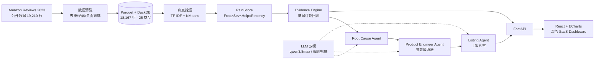
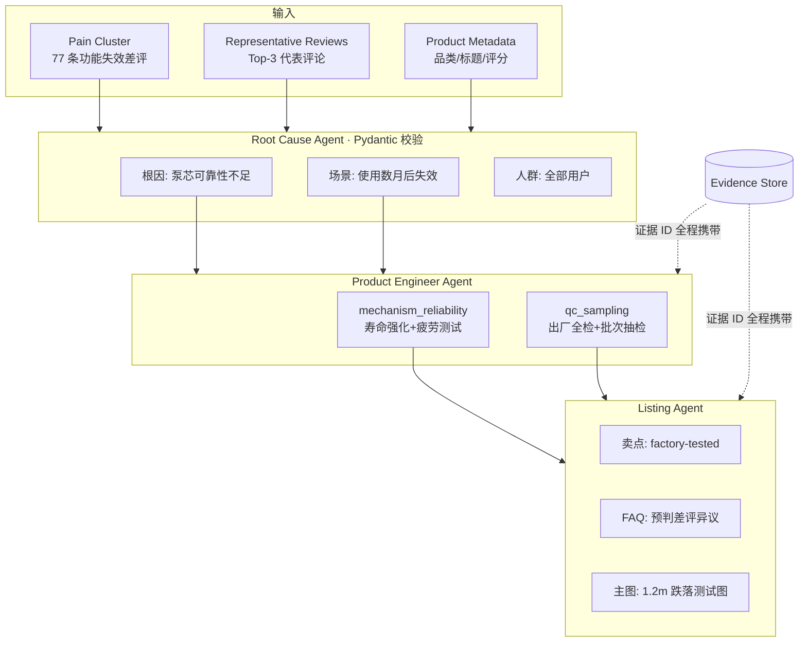

# PPT_MATERIALS — Review2Product 演示素材

> 本文件直接用于制作比赛 PPT。所有数字均为本次真实运行结果（见 RUN_REPORT.md）。

---

## 1. 一句话卖点

> **让全球消费者的每一条差评，都成为下一代产品的设计参数。**

备选短句：
- 差评不再是被折叠的噪声，而是可执行的产品需求文档。
- 从 18,167 条真实评论到 10 项工程参数改进，全程证据可回溯。

## 2. 用户痛点（讲给评委听的 Problem）

1. **读不过来**：单品上千条评论，产品经理只能抽样读，痛点识别靠直觉。
2. **结论无据**：市面工具只给"好评率 78%"，回答不了"依据哪 20 条评论、该改哪个零件"。
3. **洞察断链**：即使知道"漏液是第一大痛点"，也翻译不成"密封结构怎么改、Listing 怎么写"。

一句话：**市场有一堆"评论报表"，但没有"评论 → 产品参数"的翻译器。**

## 3. Before / After

| 维度 | Before（人工/传统工具） | After（Review2Product） |
|---|---|---|
| 痛点发现 | 人工抽样阅读 3-5 天 | TF-IDF+KMeans 聚类 **3 秒** |
| 优先级 | 拍脑袋排期 | PainScore 四因子可解释评分 0-100 |
| 证据 | 无 / 截图散落 | 每个结论点击回溯 **12 条原始评论** |
| 行动 | 一份 PPT 报告 | **10 项参数级改进** + 完整 Listing 素材 |
| 可信度 | "我觉得" | "依据 77 条真实差评，平均 1.43 星" |

Demo 实例（Segbeauty 喷雾瓶，1,420 评论）：
- Before：功能失效 77 条差评（36.5% 负面，avg 1.43★）被淹没在 4.44★ 的高分海洋里。
- After：PainScore 100 → 机构寿命强化 + 出厂全检参数改进 → Listing 直接写 "factory-tested long-life mechanism"。

## 4. 技术架构 Mermaid

## 5. Agent 架构 Mermaid

## 6. 数据来源

- **Amazon Reviews 2023**（McAuley Lab 官方公开数据集，学术业界标准基准）。
- 获取链路：HF 镜像流式抽样（免登录）→ 本地缓存 JSONL → Parquet。
- 本次运行：**19,210 行载入 → 18,167 行清洗后 · 25 商品 · 4,696 条负面**。
- **零付费**：不依赖 SimilarWeb / Helium10 / JungleScout 等付费工具；四级降级（公开源→镜像→缓存→synthetic 标记）保证断网也能演示。

## 7. 核心算法

1. **痛点聚类**：TF-IDF(1-2gram) + KMeans（k=6 轮廓系数校准）；可选 Sentence Embedding 升级，模型不可用时自动降级。
2. **IDF 加权词典标注**：痛点词典命中评分按 IDF 加权——"stopped working"（短语+低频）权重远高于 "bottle"（高频泛化词），命中占比 ≥25% 才采纳标签，杜绝"万能词吞聚类"。
3. **PainScore（可解释）**：`Frequency × Severity × Helpfulness × Recency`，0-100 归一化，四分量前端可查，**确定性计算、LLM 禁染指**。
4. **Evidence Engine**：helpful_vote×关键词命中排序选 12 条证据，全链路携带 evidence_review_ids。

## 8. 创新点（评委记忆锚）

1. **评论 → 参数的翻译器**：不是又一个情感分析仪表盘，输出直接是 `lid_seal: single seal → dual seal` 的工程语言。
2. **全链路证据可回溯**：从痛点 → 根因 → 参数 → Listing 文案，任何结论点击可见原始评论，AI 幻觉被 Evidence 机制锁死。
3. **诚实的 AI**：词典覆盖不到就标 `Other` + 人工评审建议；工程数值不敢编就标 `engineering validation required`——**不虚构是产品原则**。
4. **确定性评分**：PainScore 四因子全部可计算可复现，拒绝 LLM 随机打分。
5. **断网可演示**：四级数据降级 + LLM mock 双模，任何环境一条命令拉起完整 Demo。

## 9. Demo 流程（照此操作）

1. 打开 `http://localhost:5173` → **Product MRI**：指出 1,420 条评论、Health 85.1、Top 痛点条形图。
2. 切 **Pain Galaxy**：气泡图讲"右上角 = 高频高危"，颜色= PainScore。
3. 点击最大气泡 / 切 **Evidence**：展示 12 条真实差评原文（"stopped spraying after 2 months"）。
4. 切 **Evolution**：V1→V2 参数表，逐行讲 Current → Recommended → Evidence 数量 → Confidence。
5. 切 **Launch**：卖点/Listing/FAQ/主图策略，强调每条卖点锚定痛点与评论数。

## 10. 商业价值

- **目标客户**：跨境卖家（选品/迭代）、品牌方（VOC 产品部）、代工厂（OEM 改款依据）、SaaS 化订阅。
- **效率**：3 天人工读评 → 3 秒自动聚类；痛点排期从直觉 → 数据驱动。
- **风险控制**：Evidence 机制让每个改款决策有据可查，降低试错成本。
- **变现路径**：API 按 SKU 订阅 → 品类痛点数据库 → 选品雷达（哪个品类存在"高频高危无解药"机会）。

## 11. 与通用 LLM 对话 / 普通评论分析的区别

| | 通用 LLM 直接分析 | 普通评论分析工具 | Review2Product |
|---|---|---|---|
| 输入上限 | 上下文塞不下 18k 评论 | 全量 | **全量** |
| 打分可信度 | 随机、不可复现 | 黑盒分 | **四因子确定性公式** |
| 证据回溯 | 无/部分 | 截图 | **每个结论 12 条可点击评论** |
| 输出形态 | 一篇作文 | 报表 PDF | **参数级改进 + Listing 素材** |
| 幻觉控制 | 依赖提示词 | N/A | 词典+规则+Evidence 三重锁定 |
| 断网可用 | 否 | 部分 | **是（四级降级）** |

## 12. 三张最适合截图做 PPT 的页面

1. **`p4_evolution.png` — Product Evolution（首选主视觉）**
   V1→V2 大箭头 + 参数表（Current/Recommended/Reason/Evidence/Confidence 五列）+ Before/After 雷达图。一张图讲清"我们到底做了什么"，是与其他参赛作品拉开差距的核心页面。
   - PPT 话术："左边是卖了几千单的 V1，右边是 AI 基于差评进化的 V2，每一行改动都能点开看评论。"

2. **`p2_galaxy.png` — Pain Point Galaxy（视觉记忆点）**
   频率×严重度气泡图，蓝→紫→红渐变编码 PainScore，深色背景极具科技感。适合做章节过渡页或海报。
   - PPT 话术："右上角的红色气泡，就是下一代产品最该优先解决的问题。"

3. **`p3_evidence.png` — Evidence Explorer（可信度证明）**
   左痛点列表 + 右 12 条真实评论卡片（星级/原文/helpfulness/ID）。评委质疑"AI 编的？"时切换到此页。
   - PPT 话术："我们不下结论，我们搬运结论——每条建议背后是真实消费者的原话。"
