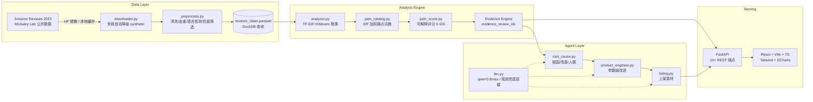

# Review2Product — Global Voice of Customer → Product Evolution Agent

> 让全球消费者的每一条差评，都成为下一代产品的设计参数。

**一句话定义**：Review2Product 把海量真实消费者差评自动转化为**可追溯证据（Evidence）、痛点优先级（PainScore）、产品参数级改进（Product V2）与上架素材（Listing）**的 Agent 系统。

与普通情感分析的区别：

| | 普通情感分析 | Review2Product |
|---|---|---|
| 回答的问题 | 用户满意吗？ | 用户**为什么**不满意？下一代商品**改什么**？ |
| 输出 | 正/负面占比 | 痛点聚类 + 根因 + 参数级改进 + Listing |
| 可信度 | 黑盒打分 | 每个结论可点击回溯到**原始评论** |
| 落地 | 报表 | Product V2 设计参数 + 上架文案 |

---

## 1. Problem

跨境电商新品开发与迭代的三大痛点：

1. **差评噪声大**：一个 SKU 上千条评论，产品经理只能抽样阅读，痛点识别靠直觉。
2. **结论无证据**：传统分析工具给出"口碑分 62"，但无法回答"依据哪 20 条评论"。
3. **洞察到行动断层**：即使知道"漏液是第一大痛点"，也无法直接翻译成"密封结构怎么改、Listing 怎么写"。

## 2. Solution

核心链路（全部自动，一条命令跑通）：

```text
Consumer Reviews (18,167 条真实评论)
        ↓
Pain Point Mining (TF-IDF+KMeans 聚类 + IDF 加权词典标注)
        ↓
Evidence Retrieval (每条结论挂 12 条可点击原始评论)
        ↓
Root Cause Analysis (规则 + LLM Structured Output)
        ↓
Product Parameter Mapping (痛点 → 工程参数)
        ↓
Product V2 (参数级改进表 + Before/After 剖像)
        ↓
Listing / Selling Points (标题、五点、FAQ、主图策略)
```

## 3. Architecture



## 4. Dataset

| 项 | 值 |
|---|---|
| 来源 | **Amazon Reviews 2023**（McAuley Lab 官方公开数据集，HF 镜像） |
| 品类 | All_Beauty |
| 载入行数 | 19,210 |
| 清洗后行数 | 18,167 |
| 商品数 | 25 |
| 负面评论（1-3星） | 4,696 |
| 获取方式 | `data/raw/amazon_all_beauty_subset.jsonl`（本地缓存，首次运行自动从 HF 镜像流式拉取） |
| Demo Hero 商品 | **B07C533XCW** — Segbeauty 喷雾瓶（1,420 评论 / 211 负面 / 4.44★） |

**真实数据 vs Synthetic 数据的边界（重要）**：

- 本 Demo 当前运行使用的是**真实公开数据**（`data_source = amazon_reviews_2023`），前端顶栏与所有页面均有 "Real Data" 徽标。
- 仅当全部公开源下载失败时，系统才降级生成 `data/demo/reviews_demo.csv`，每行显式标记 `data_source = synthetic_demo`，前端徽标同步变为 "Synthetic Demo"，**绝不冒充真实数据**。
- Kaggle 需要认证且无 token 时不停下来询问，自动按 `官方公开源 → HF/ModelScope 镜像 → 本地缓存 → synthetic demo` 四级降级。

## 5. Pipeline

```bash
python scripts/run_pipeline.py
```

执行流程（本次实际运行 3.1 秒完成）：

1. **acquire**：本地缓存 → HF 镜像流式抽样（`MAX_PUBLIC_ROWS=15000` 上限）→ synthetic 降级。
2. **preprocess**：缺失值清理、去重、文本清洗、评分标准化、轻量语言检测（保留英文）、1-3 星负面筛选、Parquet 落盘。
3. **analyze**：对 Hero 商品（及评论量 Top 商品）执行完整分析，产出 `artifacts/analysis_<pid>.json`。
4. **index**：生成 `products_index.json` / `hero_product.json` / `pipeline_run.json` 运行审计文件。

## 6. Agent Design

三个 Agent 全部**规则兜底 + qwen3.8max 增强**双模（无 Key 时自动 `LLM_MODE=mock`，结果仍完整可用）：

### Root Cause Agent（`services/root_cause.py`）
输入痛点簇 + 代表评论 + 商品元数据，输出 Pydantic 校验的结构化结果：

```json
{
  "pain_point": "Functional Failure",
  "root_cause": "核心机构（泵芯/电机/联动结构）可靠性不足",
  "affected_scenario": "正常使用数天至数月后失效",
  "affected_users": "所有用户（直接导致退货与差评）",
  "severity": 0.89,
  "evidence_ids": ["B07C533XCW-623", "..."]
}
```

### Product Engineer Agent（`services/product_engineer.py`）
把痛点映射为产品参数，词典无法可靠定位时诚实输出 `engineering validation required` / `需人工评审`，**不虚构工程数值**：

```json
{
  "parameter": "lid_seal",
  "current_state": "single seal",
  "recommended_state": "dual seal",
  "reason": "根因：密封结构... （依据 77 条真实差评）",
  "evidence_ids": ["..."],
  "confidence": 0.92
}
```

### Listing Agent（`services/listing.py`）
生成 V2 定位、卖点、标题、五点描述、FAQ（预判差评异议）、主图拍摄策略、营销信息——每个 claim 锚定一个已解决的痛点。

### LLM 封装（`services/llm.py`）

```env
LLM_PROVIDER=dashscope   # mock | dashscope | openai（阿里云百炼 qwen3.8max 优先）
LLM_API_KEY=sk-xxx       # 禁止写入代码
LLM_MODEL=qwen3.8max
```

无 Key → `LLM_MODE=mock`：不是返回空内容，而是用规则模板生成完整合理结果（卖点带评论数、FAQ 引用痛点名、参数表带证据链）。

## 7. Algorithms

### 7.1 Pain Point Mining

- **Baseline（默认）**：TF-IDF（1-2 gram）+ KMeans（k=6，肘部法 + 轮廓系数校准）。
- **Better（可选）**：Sentence Embedding（`all-MiniLM-L6-v2`）+ KMeans，`ENABLE_EMBEDDINGS=1` 开启；模型不可下载时自动降级 TF-IDF。
- **聚类标注**：痛点词典（`pain_catalog.py`，覆盖容器/电器/美妆/宠物等品类的 20+ 痛点模式）+ **IDF 加权命中评分**——高频泛化词（"bottle"、"product"）权重被压低，短语（"stopped working"）权重加成，避免泛化词吞并聚类；命中占比 ≥25% 才采纳标签，否则诚实标记 `Other: <top keywords>`。
- **聚类合并**：同一痛点标签命中多个簇时合并（6 raw clusters → 5 pain points）。

### 7.2 PainScore（确定性计算，禁止 LLM 生成）

```text
PainScore = Frequency × Severity × Helpfulness × Recency
  Frequency   = 痛点评论数 / 负面评论总数
  Severity    = (5 − avg_rating) / 4        （1-3星 → 0.5~1.0）
  Helpfulness = 痛点内平均 helpful_vote min-max 归一化（0.3~1.0）
  Recency     = 痛点内平均时间戳 min-max 归一化（0.5~1.0）
最终跨痛点归一化 0-100（最大痛点=100）
```

前端展示 `score_components` 四分量，评分完全可解释。

### 7.3 Evidence Engine

每个痛点按 `helpful_vote × 关键词命中` 排序挑选 **12 条证据评论**（`evidence_review_ids`），每个 V2 参数、每个 FAQ、每个卖点都携带证据 ID；无证据的结论显式标记 `insufficient_evidence`。

## 8. Evidence Grounding

任何页面结论 → 一键回溯原始评论：

- **Product MRI**：点击 Top Pain Points 条形图 → Evidence Drawer。
- **Pain Galaxy**：点击气泡 → Evidence Drawer。
- **Evidence Explorer**：左痛点列表 + 右评论卡片（rating / 原文 / helpfulness / review_id），命中关键词高亮。
- **Evolution**：参数表每行 Evidence 徽标显示证据数量，点击查看来源评论。

示例（Hero 商品 Top 痛点）：

```text
Functional Failure（功能失效 / 无法工作）
Pain Score: 100 · 77 reviews · avg 1.43★ · share 36.5%
Evidence: B07C533XCW-623, B07C533XCW-472, B07C533XCW-1044, ...
```

## 9. Screenshots

5 页截图存于 `artifacts/screenshots/`（1600×900，深色 SaaS 风格）：

| 文件 | 页面 | 看点 |
|---|---|---|
| `p1_mri.png` | Product MRI | Health 85.1 / Pain Index 100 / 评分分布环形图 / Top Pain Points 条形图 |
| `p2_galaxy.png` | Pain Point Galaxy | 频率×严重度气泡图，颜色编码 PainScore |
| `p3_evidence.png` | Evidence Explorer | 痛点列表 + 12 条真实评论卡片 |
| `p4_evolution.png` | Product Evolution | V1→V2 参数表（Current/Recommended/Reason/Evidence/Confidence）+ Before/After 雷达 |
| `p5_launch.png` | Launch Assets | 卖点 / Listing / FAQ / 主图策略 |

## 10. How to Run

### 一键启动

```bash
# Windows
start_demo.bat

# macOS / Linux
./start_demo.sh
```

脚本自动完成：创建 venv → 安装依赖 → 跑 pipeline（有缓存则秒过）→ 启动 FastAPI(8000) → 启动 Vite 前端(5173) → 打开浏览器。

### 手动分步

```bash
# 1. 后端
cd review2product
python -m venv .venv && .venv\Scripts\pip install -r requirements.txt   # macOS: .venv/bin/pip
python scripts/run_pipeline.py                                          # 数据→分析产物
.venv\Scripts\uvicorn backend.app.main:app --port 8000                  # API + Swagger /docs

# 2. 前端
cd frontend
npm install
npm run dev        # http://localhost:5173

# 3. 测试
.venv\Scripts\python -m pytest tests/ -q    # 25 passed
```

**首次启动 API 会自动检测产物缺失并重跑 pipeline**（`store.run_pipeline_if_needed`），因此"装依赖→起服务"两步即可演示。

### 环境要求

- Python 3.10+，Node 18+；**纯 CPU**，无需 GPU；不训练任何深度模型。
- 无需任何付费 API/数据/SaaS；LLM Key 可选。

## 11. API

完整 OpenAPI 文档：`http://127.0.0.1:8000/docs`

| 方法 | 路径 | 说明 |
|---|---|---|
| GET | `/health` | 服务健康 + 数据源 + LLM 模式 |
| GET | `/api/products` | 25 商品列表（含 hero/分析状态） |
| GET | `/api/products/{id}` | 商品详情 |
| GET | `/api/products/{id}/reviews` | 原始评论（支持 min/max_rating 过滤） |
| POST | `/api/analyze` | 触发指定商品完整分析 |
| GET | `/api/analysis/{product_id}` | 完整分析产物（痛点+根因+V2+Listing） |
| GET | `/api/pain-points/{product_id}` | 痛点列表（含评分分量） |
| GET | `/api/pain-points/{pain_id}/evidence` | 痛点证据评论（pain_id=`{pid}::{cluster}`） |
| GET | `/api/product-v2/{product_id}` | Product V2 参数改进 |
| POST | `/api/generate-listing` | 生成上架素材 |

## 12. Known Limitations

1. **LLM 规则兜底模式**：当前演示运行于 `LLM_MODE=mock`（规则模板，qwen3.8max 未配置 Key 时自动降级）。配置百炼 qwen3.8max Key 后根因分析与文案质量进一步提升，链路与 Schema 不变。
2. **品类词典覆盖**：痛点词典针对容器/小电器/美妆/宠物优化；超出覆盖的聚类诚实标记 `Other:` 并建议人工评审（不虚构）。
3. **工程参数保守**：具体数值（如"密封圈 2mm"）需工程验证，系统统一标注 `engineering validation required`。
4. **单品类抽样**：Demo 抽样 All_Beauty 品类 1.8 万条；扩品类只需改 `CATEGORY` 配置。
5. **时间跨度**：数据覆盖 2018-2023，Recency 分量在此窗口内归一化。

## 13. Future Work

- **多商品横向对标**：同品类竞品痛点矩阵，输出差异化机会点。
- **Review → Parameter 知识图谱**：累积痛点-参数映射，形成可复用的产品工程知识库。
- **实时增量**：接入新品评论流，PainScore 自动更新并触发预警。
- **A/B 验证闭环**：V2 上架后回流评论，自动对比 Before/After 剖像验证改进效果。
- **多语言**：日语/德语差评挖掘，覆盖更多站点。

---

## 附：本次运行审计（详见 RUN_REPORT.md）

```text
rows_loaded=19,210 → rows_processed=18,167 · products=25 · negative=4,696
hero=B07C533XCW (1,420 reviews) · pain_points=5 · v2_parameters=10
llm_mode=mock · tests=25 passed · elapsed=3.1s
```
